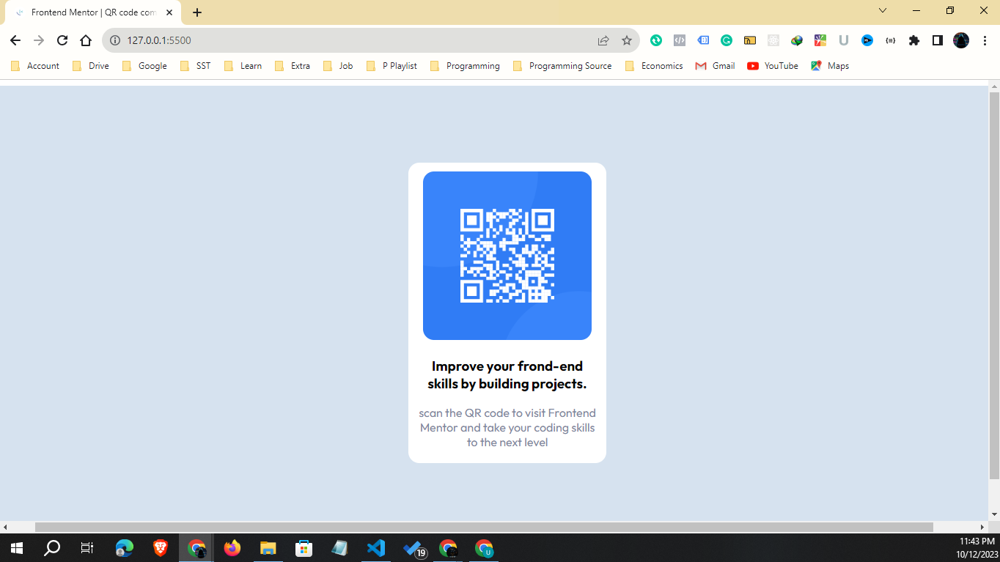
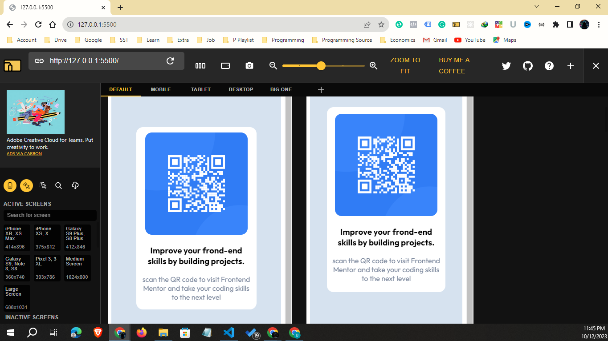

# Frontend Mentor - QR code component solution

This is a solution to the [QR code component challenge on Frontend Mentor](https://www.frontendmentor.io/challenges/qr-code-component-iux_sIO_H). Frontend Mentor challenges help you improve your coding skills by building realistic projects. 

## Table of contents

- [Overview](#overview)
  - [Screenshot](#screenshot)
  - [Links](#links)
- [My process](#my-process)
  - [Built with](#built-with)
  - [What I learned](#what-i-learned)
  - [Continued development](#continued-development)
- [Author](#author)
- [Acknowledgments](#acknowledgments)

**Note: Delete this note and update the table of contents based on what sections you keep.**

## Overview
wow...!!! thats an awesome experience for me. I am new and beginer at this field. I am trying to solve this challenge. Really i enjoy it...

### Screenshot

I have added the screenshot of the result. You can check it from here.

### Links

- Solution URL: [solution URL](https://github.com/Ashiqur2279/QR-code-solution.git)
- Live Site URL: [live site](https://unique-queijadas-bdda50.netlify.app/)

## My process
At first I ready the HTML file for the QR code. Then create a CSS file and then give the relevant style for make the design properly. Although as a beginer it was a nice experience for me. Really i enjoy it. I excited for get the new challenge.

### Built with

- Semantic HTML5 markup
- CSS custom properties
- Flexbox

### What I learned

I learn from here how do make start a project and how to handle it. i think this will be make my experience as well.

### Continued development

Use this section to outline areas that you want to continue focusing on in future projects. These could be concepts you're still not completely comfortable with or techniques you found useful that you want to refine and perfect.

**Note: Delete this note and the content within this section and replace with your own plans for continued development.**

## Author

- Website - Ashiqur Rahman
- Frontend Mentor - [@Ashiqur2279](https://www.frontendmentor.io/profile/Ashiqur2279)

## Acknowledgments

This is where you can give a hat tip to anyone who helped you out on this project. Perhaps you worked in a team or got some inspiration from someone else's solution. This is the perfect place to give them some credit.

**Note: Delete this note and edit this section's content as necessary. If you completed this challenge by yourself, feel free to delete this section entirely.**
